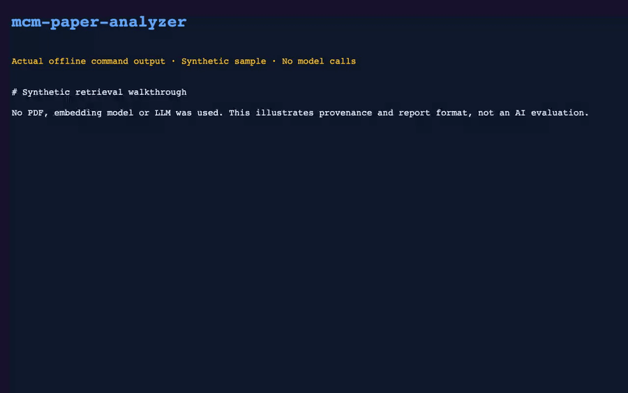

# MCM Paper Analyzer

Retrieve relevant methods and sections from your reference papers, then generate a source-backed Markdown review of your draft.

[中文](README.md) · [Offline example](examples/README.md)


Python · PyMuPDF · ChromaDB · RAG · Apache-2.0

[Read the complete synthetic sample report](docs/sample-report.md)



Recorded actual offline command output with synthetic passages and fixed retrieval substitutes; not an LLM evaluation.

## How it works

PDF parsing → coarse/fine indexes → semantic and section retrieval → paper comparison → revision report. Retrieval also considers problem type and problem letter, and removes duplicate passages.

## Start locally

```sh
git clone https://github.com/luxiaoyu0731/mcm-paper-analyzer.git
cd mcm-paper-analyzer/mcm-analyzer
python3 -m venv .venv
.venv/bin/pip install -r requirements.txt
cp config.example.yaml config.yaml
.venv/bin/python main.py ingest --dir ./data/o_award_papers/ --no-vision
.venv/bin/python main.py analyze --paper ./my_paper.pdf --compare
```

Configure the provider in local `config.yaml` and supply PDFs you have permission to use. No competition papers are redistributed. Import and analysis both call the model; **`--no-vision` disables image calls only**. Initial use may download embedding weights. Paper excerpts can be sent to your provider.

## Free first look

```sh
python3 examples/try_retrieval.py --destination ../mcm-sample
```

Runs the real retrieval merging and ranking code with an explicitly synthetic in-memory store. No model downloads, credentials or provider calls. The example report demonstrates its format, not AI quality or contest performance.

<details><summary>Development and limits</summary>

```sh
python3 -B -m unittest discover -s tests -v
```

Model scores are not award probabilities. The full PDF-to-model-to-report pipeline needs separate validation.

[Code review](docs/code-review.md) · [Contributing](CONTRIBUTING.md) · [Security](SECURITY.md) · [Asset credits](docs/media/README.md)

</details>

[Apache-2.0](LICENSE)

[Report a bug](https://github.com/luxiaoyu0731/mcm-paper-analyzer/issues/new?template=bug_report.yml) · [First-use feedback](https://github.com/luxiaoyu0731/mcm-paper-analyzer/issues/new?template=first_use.yml) · [Starter tasks](CONTRIBUTING.md)

[Versioned releases and artifact verification](docs/releasing.md)
