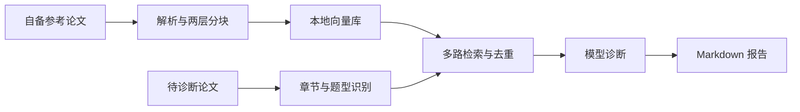

# MCM Paper Analyzer

### 用参考论文，帮助解释一篇论文该怎样改。


Python · PyMuPDF · ChromaDB · 本地向量检索 · Apache-2.0

[快速开始](#快速开始) · [检索与诊断](#检索与诊断) · [代码审查](docs/code-review.md)

一个面向 MCM/ICM 论文的 RAG 诊断工具：将用户提供的参考论文分块入库，按章节、题型和题号检索，组织逐章节分析与修改建议。输出 Markdown 报告，方便对照原文继续编辑。

## 检索与诊断

| 环节 | 实现 |
|---|---|
| 解析 | PDF 文本、章节与图片提取 |
| 分块 | 粗粒度上下文与细粒度证据两层索引 |
| 检索 | 语义、章节、题型多路召回，题号偏好排序 |
| 诊断 | 参考片段、章节要求与用户原文一起进入模型 |
| 输出 | 章节诊断、对标与改写建议 |



参考论文不随代码分发。语义相似不等于数学正确，模型评分不是获奖概率或经过标定的质量量表。

## 快速开始

```sh
git clone https://github.com/luxiaoyu0731/mcm-paper-analyzer.git
cd mcm-paper-analyzer/mcm-analyzer
python3 -m venv .venv
.venv/bin/pip install -r requirements.txt
cp config.example.yaml config.yaml
```

在 `config.yaml` 配置模型接口；自备有权使用的参考 PDF，放入本地目录。

```sh
# 不启用图片模型分析的参考论文导入
.venv/bin/python main.py ingest --dir ./data/o_award_papers/ --no-vision
# 诊断及对比
.venv/bin/python main.py analyze --paper ./my_paper.pdf --compare
# 单章节诊断
.venv/bin/python main.py analyze --paper ./my_paper.pdf --mode section --section modeling
```

模型与嵌入权重需自行准备；首次使用本地向量模型可能下载权重。CLI 适配能力见 `analysis/analyzer.py`，当前命令入口主要使用配置的 API 客户端，不承诺所有套餐或客户端均可直接调用。

## 代码地图

| 路径 | 职责 |
|---|---|
| mcm-analyzer/main.py | 配置与命令入口 |
| core/parser.py、chunker.py | PDF 解析与分块 |
| core/embedder.py、vectorstore.py | 编码与持久化索引 |
| core/retriever.py | 多路召回、题号加权与可选重排序 |
| analysis/ | 提示词、诊断编排与报告生成 |

不下载模型、不调用付费接口的检索回归测试：

```sh
python3 -B -m unittest discover -s tests -v
```

## 隐私与使用边界

PDF 文本提取与向量化主要在本地；启用图片分析时图片可能发给外部模型，诊断时原文片段与参考片段也会发送。密钥只存本地配置，禁止提交 `config.yaml`。请使用获得授权的论文材料。

当前回归覆盖排序一致性与缓存不被修改；整条 PDF→模型→报告流程尚无自动化验收，详见[代码审查](docs/code-review.md)。

原创代码采用 [Apache-2.0](LICENSE)，论文、依赖和模型权重保留各自许可。[素材说明](docs/media/README.md)。
